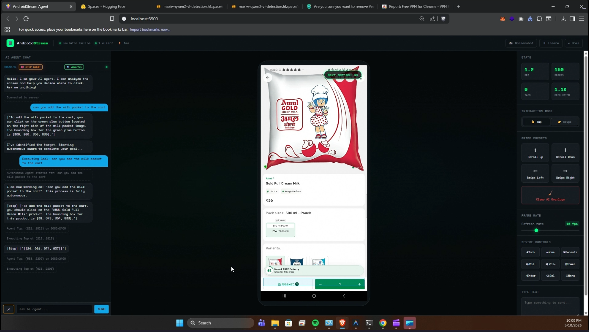
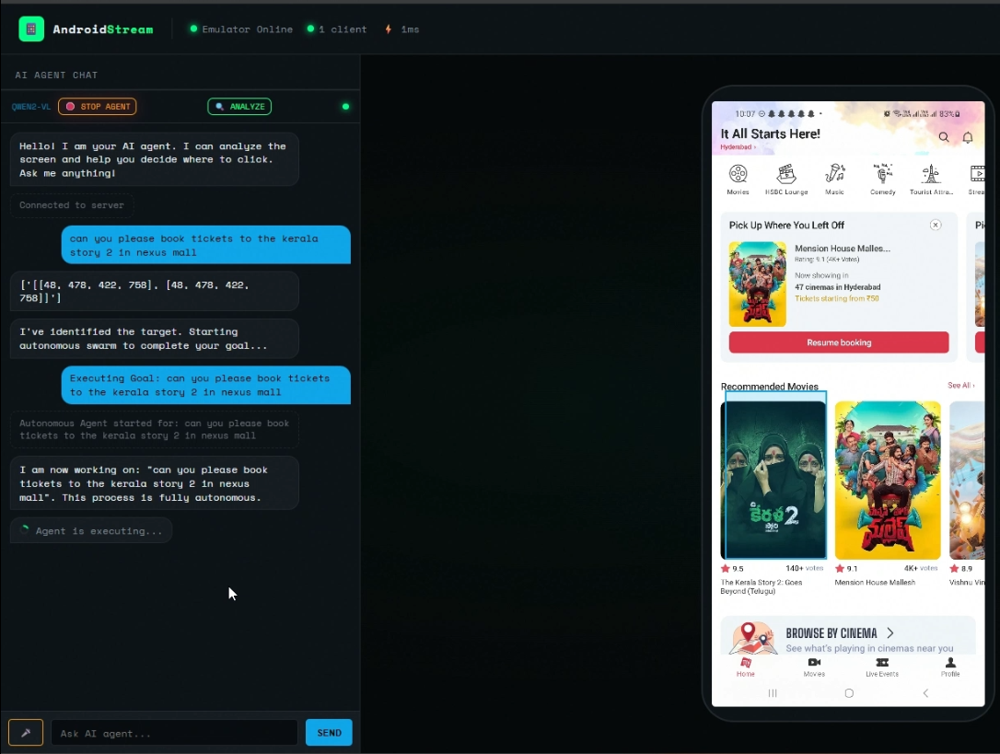
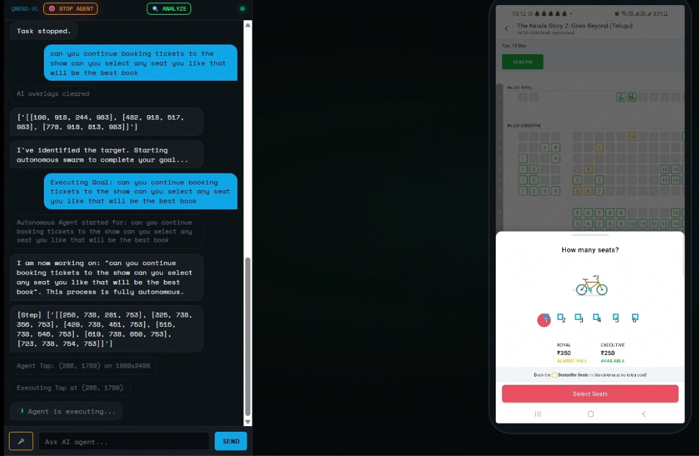
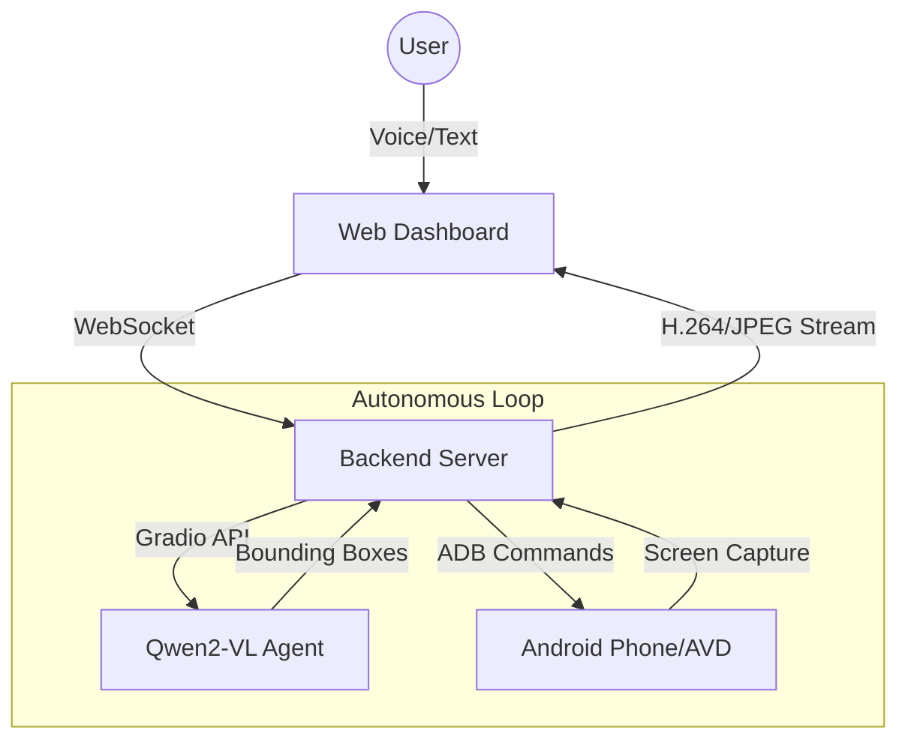

# Omni-Commander: Android AI Stream 📱



Transform your Android device into a fully autonomous AI-controlled workstation. **Omni-Commander** allows you to stream, control, and automate your Android device directly from the browser with a high-intelligence AI swarm and voice integration.

---

## 🚀 Key Features

- **🎙️ Voice-to-Action**: Issue complex goals via the Web Speech API (e.g., "Book a movie ticket").
- **🧠 Goal Swarm (Autonomous AI)**: Powered by **Qwen2-VL**, the agent analyzes the screen, identifies elements (seats, buttons, inputs), and executes multi-step tasks independently.
- **🎬 High-Performance Streaming**: Up to 60 FPS low-latency stream for local USB connections.
- **⚡ Enforced Reasoning**: 10-second wait intervals between actions to allow UI "cure time" and intelligent planning.
- **📟 Visual Feedback**: Real-time bounding boxes, step logs, and a countdown overlay on the device screen.
- **🛠️ Remote Control**: Full keyboard/mouse bridge for taps, swipes, and high-speed typing.

---

## 🖼️ Demos

| Autonomous Swarm | Visual Detection | Goal Tracking |
| :---: | :---: | :---: |
|  |  |  |

---

## 🏗️ Architecture



### 🛰️ Technology Stack
- **Frontend**: Vite, Vanilla JS, CSS3 (Glassmorphism), Web Speech API.
- **Backend**: Node.js, Express, WebSocket (ws), Proxy.
- **Core**: ADB (Android Debug Bridge) for low-level device interaction.
- **AI**: Qwen2-VL-7B-Instruct (via Hugging Face Spaces).

---

## 🛠️ Installation & Setup

### 1. Requirements
- **Node.js** v18+ 
- **ADB** installed and added to PATH.
- **Android Device** with USB Debugging (Security Settings) enabled.

### 2. Configuration
Create a `.env` file in the root:
```env
HF_TOKEN=your_huggingface_token
PORT=3500
DEVICE_ID=your_adb_device_id
```

### 3. Run it
```bash
# Install dependencies
npm install

# Build the frontend
cd client && npm install && npm run build && cd ..

# Start the commander
node server.js
```

### 4. Open in Browser
Visit `http://localhost:3500`

---

## 🐳 Docker Deployment
```bash
docker-compose up --build
```
*Note: Ensure ADB is running on your host machine.*

---

## 🏆 Hackathon Notes
This project was built to demonstrate the future of **mobile-agentic workflows**. By combining computer vision with low-latency hardware control, we've created a "headless" commander that can perform any task a human can do on a phone.

Built with ⚡ by the Omni-Team.

